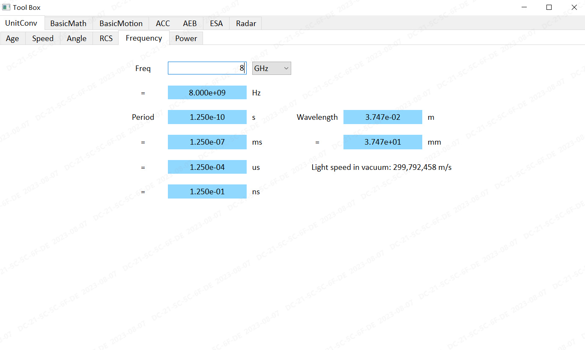

# fr-tool-box-win

This is a PyQt6 based tool box for basic automotive calculation and graph plotting. 

## Windows 10 / Linux-based OS

### Prerequisites:

* Python3

* PyQt6

* pyqtgraph

* Qt Creator (For developers to design layouts)

### Installation:

* To install PyQt6 and pyqtgraph modules, run command `pip install pyqt6` and `pip install pyqtgraph` in Terminal

* Download & install [Qt Designer](https://www.qt.io/download) to edit UI

## Running the Tool Box in Python:

* Run command `python main.py` to view the Tool Box app

## Editing Tool Box UI:

* Open `tool-box-interface.ui` in Qt Creator to view and modify UI

* Run `pyuic6 -x tool_box_interface.ui -o tool_box_interface.py` to generate corresponding Python file

## Deploying to an executable file

* The pyinstaller tool is used for packaging our app. Run `pip install pyinstaller` in Terminal to install this module.

* Run `pyinstaller --add-data 'image;image' -n 'Tool-Box' -wF main.py` in Windows
  or `pyinstaller --add-data 'image:image' -n 'Tool-Box' -wF main.py` in Linux to package the app into a single executable.

* After packaging is done, the executable file "Tool-Box" can be found in the folder `dist/`.

## App Overview for Users

As of Aug.7 2023, This toolbox consists of seven major tabs: "UnitConv", "BasicMath", "BasicMotion", "ACC", "AEB", "ESA" and "Radar"

### UnitConv

"UnitConv" is for performing unit conversions. With provided input field and unit, results are generated. Conversions include:

* Age: year, month, day

* Speed: kph, m/s, mph

* Angle: deg, rad, sin, cos, tan

* RCS: dBsm, m^2

* Frequency: GHz, MHz, KHz, Hz; Period: s, ms, us, ns; Wavelength: m, mm

* Power: dBm, mW, W

* Example: 

### BasicMath

"BasicMath" is for simple mathematical, geometric calculations. The calculations include: 

* Arc: get arc length $l$ from central angle $\theta$ and radius $r$; or get central angle $\theta$ from arc length $l$ and radius $r$

* Triangle: get height $h$ from angle $\theta$ and base $b$; or get angle $\theta$ from height $h$ and base $b$

* Bit vs. Dec: get maximum decimal value from bit length

* Curve: get curvature, radius and latitudinal distance from velocity, yawrate and longitudinal distance

* Example: 

### BasicMotion

"BasicMotion" is for basic motion calculations and graph plotting

* Lin. Acc: calculate and plot linear acceleration performance from three parameters among $v_0$, $v_1$, $dt$, $a$ and $s$

* Centrif. Acc: calculate centrifigal acceleration performance from two parameters among radius $r$, speed $v$ and lat. accel $a$

* TTC: calculate and plot TTC from $v_1$, $a_1$, $v_2$, $a_2$ and separation $s$. Gives warning if TTC is under 5 seconds. 

* Lane Maneuver: calculate $S_{critical}$ and $V_{s_{min}}$ from $V_{rear}$, $V_{ACSF}$, $a$, $t_B$ and $t_G$

* Example: 

### ACC

"ACC"  is for basic calculations and simulations in ACC design.

* FOV and Timegap: calculate timegap from detection distance, ego speed and target speed; calculate initial detection distance by taking radar cycle and initial tracking cycles into consideration

* Follow Dist.: calculate target distance and acceptible azimuth error from ego speed, headway time and lane width. 

* Detect and Follow Range: get plot of host and target movement in ACC detection based on given parameters like FOV, max deceleration, max jerk etc.

* Sensor Range: generate table of results that show required sensor range to keep safety distance in two scenarios, without driver intervention and with driver handover, for a range of host and target speed

* Example: 
  
  

### AEB

"AEB" is for simulation of stopping distance from given AEB parameters, in the scenario of AEB against stationary target.

* In Step 1, AEB pre-fill/partial brake/full brake parameters are entered and max speed reduction is calculated

* In Step 2, other time parameters and host initial speed is entered. AEB response times, AEB ramp-up rates and required AEB distance is calculated

* Based on the data obtained to this point, plot diagrams of AEB deceleration, speed and distance are generated.

* Example: 

### ESA

"ESA" is for calculating and plotting lateral offset distance and lateral acceleration of maximum and minimum required TTC from yaw slew rate, max yawrate and vehicle speed provided.

* Example: 

### Radar

"Radar" is a tab for basic calculations of radar properties.

* Doppler Shift Freq: calculate recieved frequency and Doppler shifted frequency from ego speed, target speed and base frequency entered by the user

* Corner Reflector RCS: calculate RCS from edge $L$ and frequency $f$ entered by the user

* Doppler Detection Sim: calculate Doppler velocity from ego speed, target speed and target x and y position data entered by the user

* Doppler Detection to Abs Dynamics: calculate target absolute $v_x$ and $v_y$ from target direction, detected speed and ego speed entered by the user

* Radar Equation: calculate distance to target from user entered $P_r$, $P_t$, $G_r$, $G_t$, $r$ and $f$.

* Example: 
